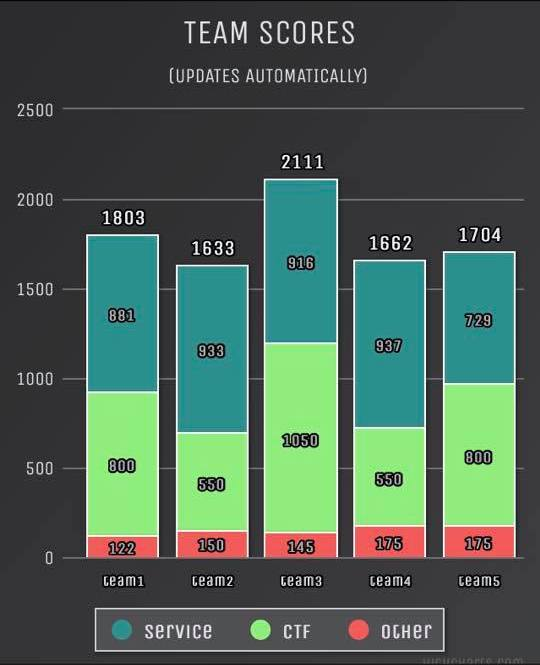
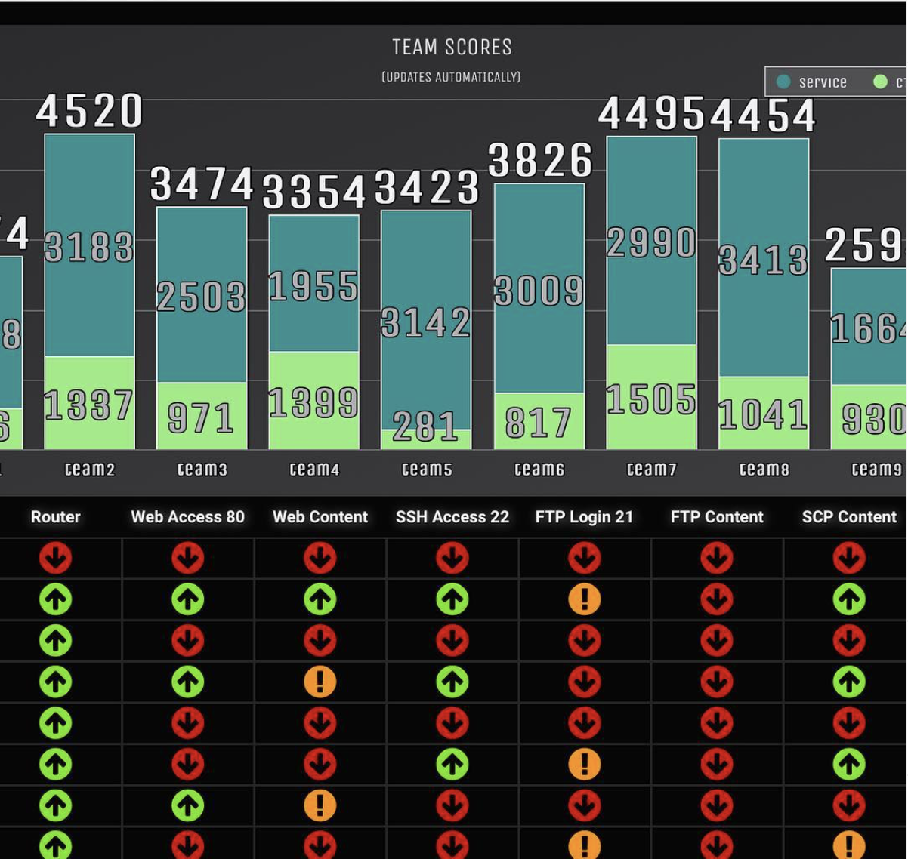
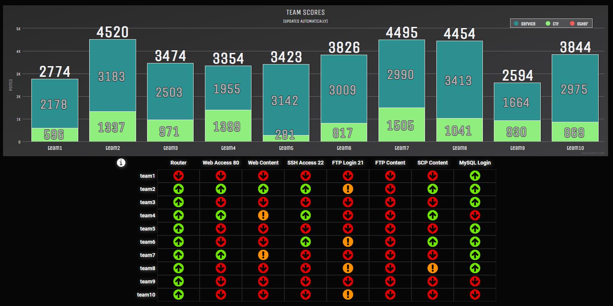
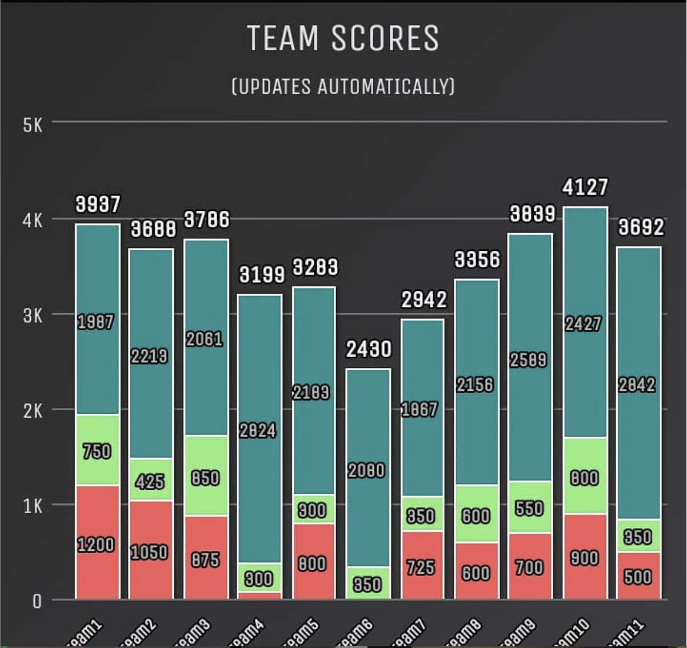

# Activities

## 2020

### April

#### [CNYHackathon, April 17-18, 2020](https://www.cnyhackathon.org)

This hackathon, I was on team 3, generally leading CTF. I was especially effective on the reversing challenges (python, assembly, and Ook), but I helped with a bunch of the other ones as well. It was a really great hackathon, and, while the face-to-face interaction was definitely missed, it progressed pretty smoothly. At the end, I was voted the most valuable team member by my team! I can't wait for next semester!

## 2019

### November

#### [CNYHackathon, November 1-2, 2019](https://www.cnyhackathon.org)

This hackathon, I finally was on the winning team (team 7).

### April

#### [CNYHackathon, April 5-6, 2019](https://www.cnyhackathon.org)

I was on Team 7 this semester, and we were sooo close to a W, it wasn't even funny. We thought that we had won, because nobody else had completed a certain challenge. Apparently they completed it with seconds to spare and got the points.

## 2018

### November

#### [CNYHackathon, November 2-3](https://www.cnyhackathon.org)

## 2017

## 2016

